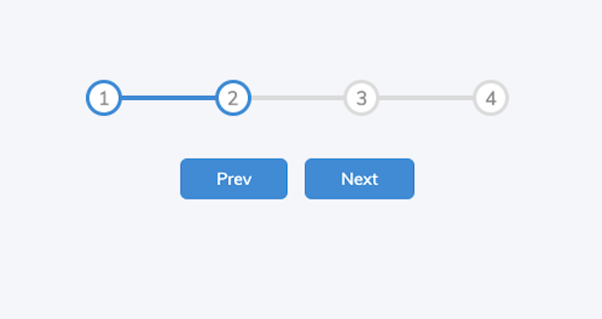
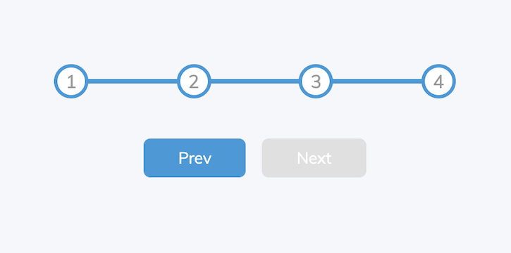
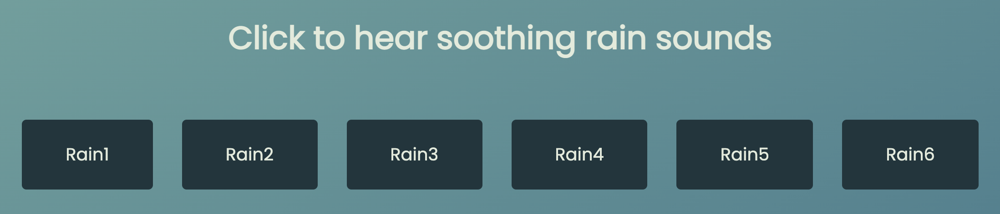

# Mini-projects

## Expanding Cards

Built with HTML/CSS/JavaScript

Photos expand on click

## Progress Bar

Built with HTML/CSS/JavaScript

## Hidden Nav

Built with HTML/CSS/JavaScript

Page rotates on click to show hidden nav

## Hidden Search

Built with HTML/CSS/JavaScript

Search bar is revealed when the search icon is clicked

## Blurry Loading

Built with HTML/CSS/JavaScript

Background image comes into focus on load

## Scroll Animation

Built with HTML/CSS/JavaScript

Content boxes come in from off screen on scroll

## Split Landing Page

Built with HTML/CSS/JavaScript

Both halves of landing page expand on hover

## Wavy Login

Built with HTML/CSS/JavaScript

Labels animate when the input is clicked

## Rain Sounds

Built with HTML/CSS/JavaScript

Each button plays a different sound when clicked

## Joke Generator

Built with HTML/CSS/JavaScript

A random joke is generated from a third-party API when the button is clicked

## Event Keycodes

Built with HTML/CSS/JavaScript

Generates keyCodes on keypress

